# Terraform & Ansible on AWS

This project demonstrates Infrastructure as Code and configuration management on AWS using **Terraform** and **Ansible**.

Terraform provisions the required AWS infrastructure, including an Amazon EC2 instance, an S3 bucket, an IAM role and instance profile, and a security group. Ansible then connects to the Terraform-provisioned EC2 instance over SSH, installs and configures Nginx, and deploys a public web page displaying:

```text
Hello, World!
```

The completed application is publicly accessible through the EC2 instance.

---

## Architecture

The solution separates **infrastructure provisioning** from **server configuration**.

Terraform manages the AWS infrastructure lifecycle, while Ansible configures the operating system and web server after the EC2 instance becomes available.

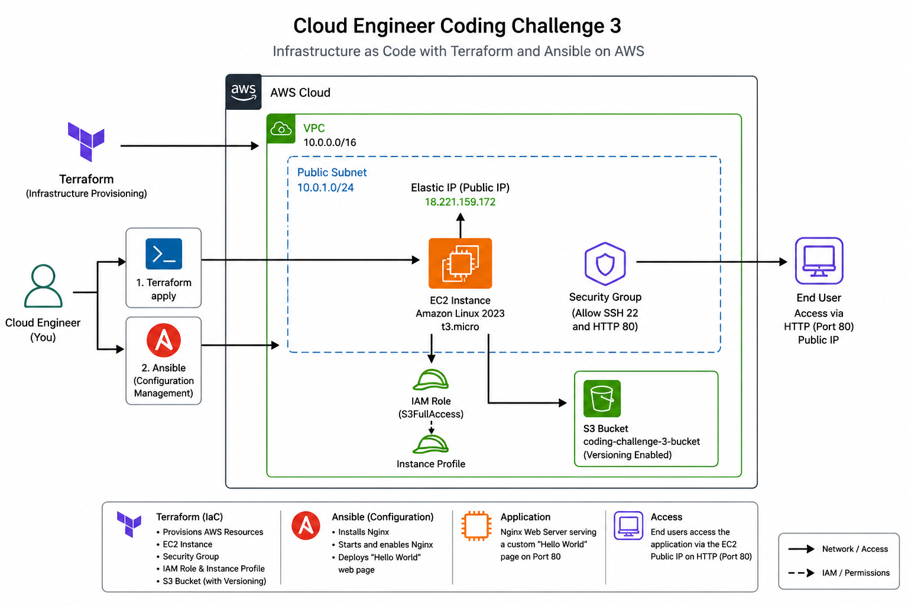

### Architecture Components

| Component | Responsibility |
| --- | --- |
| Terraform | Infrastructure provisioning and lifecycle management |
| Amazon EC2 | Hosts the Nginx web server |
| Amazon Linux 2023 | EC2 operating system |
| Security Group | Controls SSH and HTTP network access |
| AWS IAM | Provides the EC2 IAM role and instance profile |
| Amazon S3 | Terraform-provisioned storage resource |
| Ansible | Configuration management |
| SSH | Secure connection from Ansible to EC2 |
| Nginx | Web server installed and managed by Ansible |
| GitHub | Private version-controlled project repository |

### Deployment Flow

```text
Developer
   ↓
Terraform
   ↓
AWS Infrastructure
   ├── EC2
   ├── S3
   ├── IAM Role / Instance Profile
   └── Security Group
           ↓
       Public EC2 IP
           ↓
        Ansible
           ↓
    Install Nginx
           ↓
Deploy Hello, World!
           ↓
       Web Browser
```

---

## Technology Stack

### Infrastructure

- Terraform
- Amazon Web Services
- Amazon EC2
- Amazon S3
- AWS IAM
- Security Groups

### Configuration Management

- Ansible
- SSH
- WSL / Ubuntu

### Web Server

- Nginx
- Amazon Linux 2023
- HTML

### Development and Source Control

- Visual Studio Code
- PowerShell
- Git
- GitHub

---

## Repository Structure

```text
coding-challenge-3/
│
├── ansible/
│   ├── inventory.ini
│   └── playbook.yml
│
├── docs/
│   └── images/
│       ├── architecture-diagram.png
│       ├── terraform-init-validate.png
│       ├── terraform-plan.png
│       ├── terraform-apply.png
│       ├── ec2-instance-verification.png
│       ├── s3-bucket-verification.png
│       ├── security-group-verification.png
│       ├── iam-role-verification.png
│       ├── ec2-ssh-verification.png
│       ├── ansible-connectivity.png
│       ├── ansible-playbook-success.png
│       └── hello-world-browser.png
│
├── terraform/
│   ├── .terraform.lock.hcl
│   ├── ec2.tf
│   ├── iam.tf
│   ├── outputs.tf
│   ├── providers.tf
│   ├── s3.tf
│   ├── security-group.tf
│   └── variables.tf
│
├── .gitignore
└── README.md
```

Local Terraform runtime files are intentionally excluded from Git:

```text
.terraform/
terraform.tfstate
terraform.tfstate.backup
terraform.tfvars
tfplan
```

The `.terraform.lock.hcl` file is committed so Terraform provider selections remain reproducible.

---

# Prerequisites

The following tools are required to reproduce the deployment:

- AWS account
- AWS CLI
- Terraform
- Git
- Visual Studio Code
- Windows PowerShell
- WSL 2
- Ubuntu
- Ansible
- Existing EC2 SSH key pair

The implementation uses:

```text
AWS Region: us-east-2
EC2 Key Pair: jenkins-key
```

Verify AWS authentication before deploying:

```bash
aws sts get-caller-identity
```

---

# Terraform Infrastructure

Terraform is responsible for creating and managing the AWS infrastructure.

The configuration is stored in:

```text
terraform/
```

---

## Terraform Provider Configuration

The AWS provider is configured in:

```text
terraform/providers.tf
```

The project requires Terraform and the HashiCorp AWS provider.

The AWS region is configurable through a Terraform variable and defaults to:

```text
us-east-2
```

---

## Terraform Variables

Reusable values are defined in:

```text
terraform/variables.tf
```

The project uses variables for values such as:

- AWS region
- Project name
- EC2 key pair

The key pair is supplied locally using:

```text
terraform.tfvars
```

That file is excluded from Git because local variable files may contain machine-specific or sensitive configuration.

Example:

```hcl
key_name = "jenkins-key"
```

---

# EC2 Instance

Terraform creates an Amazon EC2 instance running **Amazon Linux 2023**.

The instance configuration includes:

```text
Instance Type: t3.micro
Operating System: Amazon Linux 2023
SSH User: ec2-user
```

The Amazon Linux 2023 AMI is obtained dynamically through AWS Systems Manager Parameter Store rather than hard-coding a specific AMI ID.

This makes the Terraform configuration easier to reuse as AWS publishes updated Amazon Linux images.

---

# Security Group

Terraform creates a dedicated security group for the web server.

The required challenge access rules are:

```text
TCP 22 → SSH
TCP 80 → HTTP
```

HTTP allows users to access the Nginx web page.

SSH allows the Ansible control machine to connect to the EC2 instance for configuration management.

### Security Group Verification

The deployed security group was inspected using the AWS CLI.

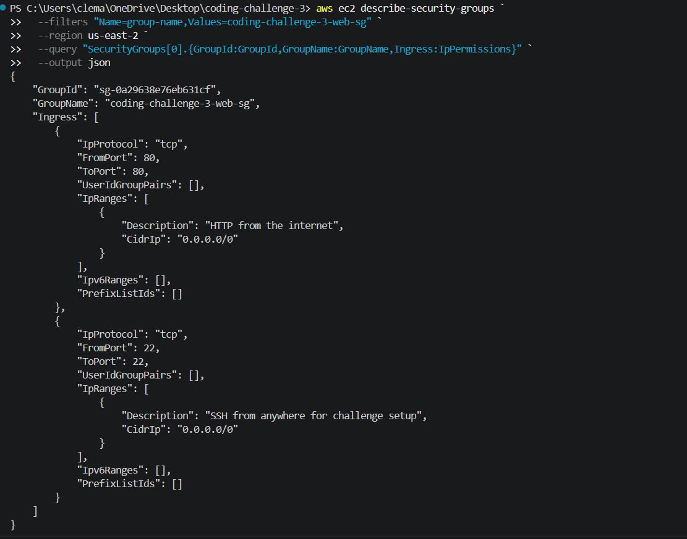

The output confirms that ports `22` and `80` are configured.

> For a production environment, SSH access should be restricted to a trusted administrator IP range rather than permitting `0.0.0.0/0`.

---

# AWS IAM

Terraform provisions:

```text
IAM Role
   ↓
IAM Instance Profile
   ↓
EC2 Instance
```

The IAM role uses an EC2 trust relationship so the instance can assume the role without storing permanent AWS credentials on the server.

### IAM Role Verification

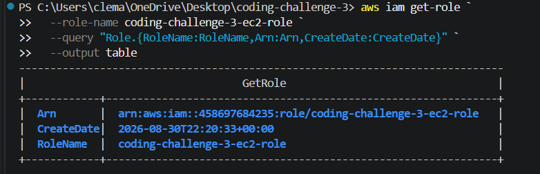

The Terraform-created role is:

```text
coding-challenge-3-ec2-role
```

---

# Amazon S3

Terraform creates an S3 bucket using a unique generated bucket name.

S3 versioning is enabled.

Versioning helps preserve previous object versions when objects are modified or removed.

### S3 Verification

The bucket was verified with the AWS CLI.

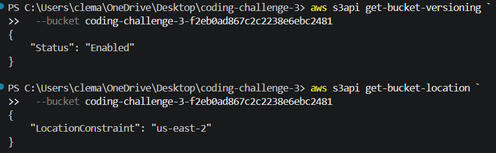

The verification confirms:

```text
Versioning: Enabled
Region: us-east-2
```

---

# Terraform Outputs

Terraform provides useful deployment outputs after infrastructure creation.

The configuration exposes:

```text
ec2_instance_id
ec2_public_ip
s3_bucket_name
ssh_command
web_url
```

This allows the public address and infrastructure identifiers to be retrieved without manually searching through the AWS console.

---

# Terraform Deployment

## Initialize Terraform

From the project root:

```bash
cd terraform
```

Initialize the Terraform working directory:

```bash
terraform init
```

Terraform downloads the required provider and creates:

```text
.terraform.lock.hcl
```

---

## Validate Terraform

Validate the configuration:

```bash
terraform validate
```

Successful validation returns:

```text
Success! The configuration is valid.
```

### Initialization and Validation Evidence

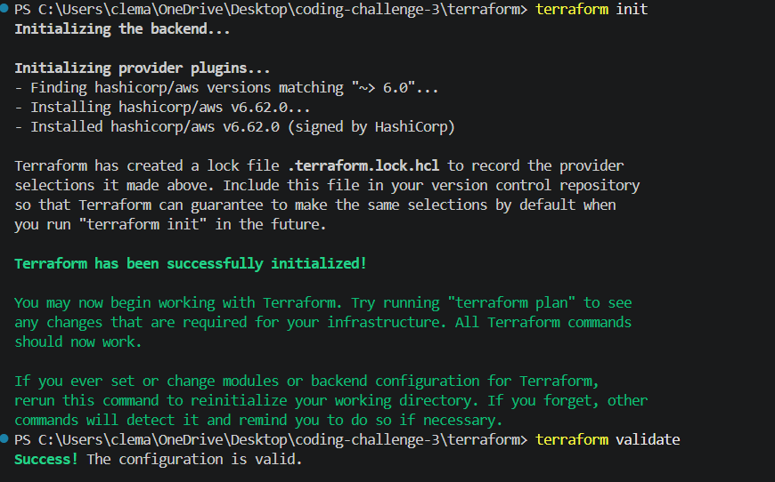

---

## Format Terraform

Terraform files can be automatically formatted using:

```bash
terraform fmt
```

---

## Create a Terraform Plan

A saved execution plan was generated with:

```bash
terraform plan -out=tfplan
```

The plan reported:

```text
Plan: 6 to add, 0 to change, 0 to destroy.
```

### Terraform Plan

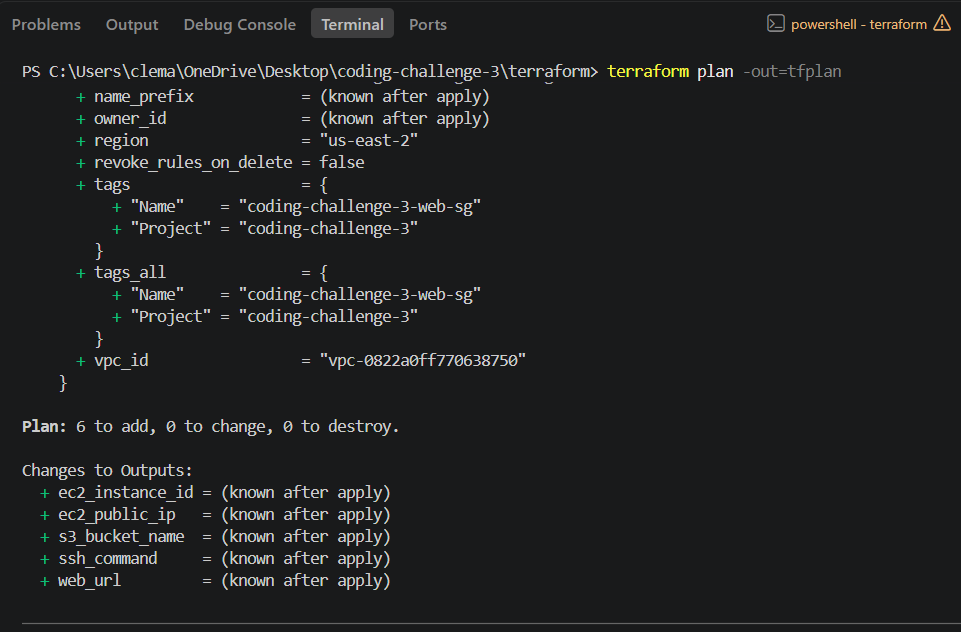

The plan was reviewed before any infrastructure was created.

---

## Apply the Terraform Plan

The reviewed plan was applied with:

```bash
terraform apply tfplan
```

Terraform successfully created all required resources:

```text
Apply complete! Resources: 6 added, 0 changed, 0 destroyed.
```

### Terraform Apply

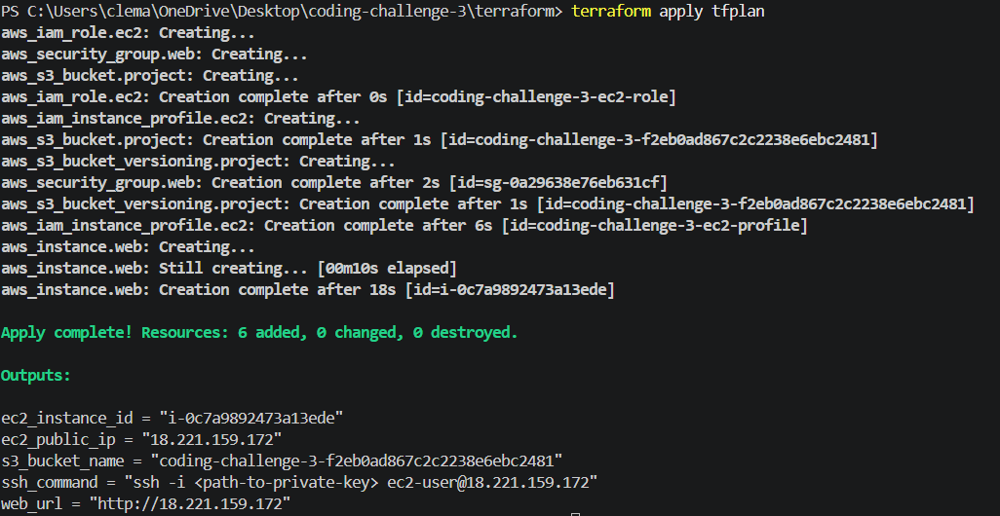

The outputs included:

- EC2 instance ID
- EC2 public IP
- S3 bucket name
- SSH connection example
- Public web URL

---

# AWS Infrastructure Verification

Infrastructure was verified independently after Terraform completed.

---

## EC2 Verification

The EC2 instance was inspected with the AWS CLI.

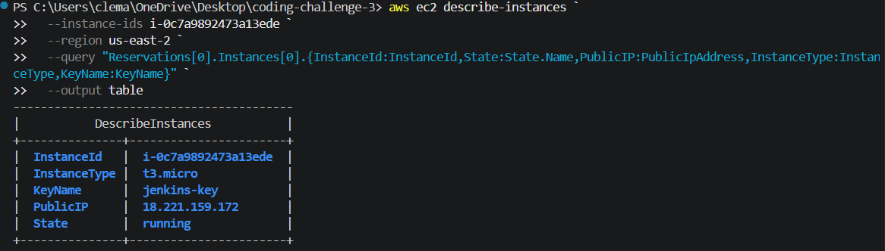

The deployed instance reported:

```text
Instance Type: t3.micro
Key Pair: jenkins-key
State: running
```

This confirms that Terraform successfully provisioned the compute resource.

---

## SSH Verification

The EC2 instance was accessed using its private key:

```bash
ssh -i ~/.ssh/coding-challenge-3.pem ec2-user@<EC2_PUBLIC_IP>
```

The Linux identity was verified with:

```bash
whoami
hostname
```

### Successful SSH Connection

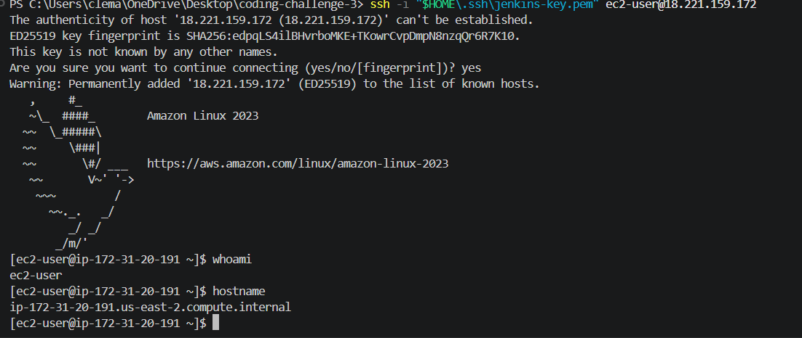

The session confirms the instance is running Amazon Linux and accepts SSH connections.

---

# Ansible Configuration Management

Terraform provisions infrastructure, but it does not configure the application software in this implementation.

Ansible performs that responsibility.

The Ansible configuration is stored in:

```text
ansible/
```

The directory contains:

```text
inventory.ini
playbook.yml
```

---

## Ansible Control Environment

Ansible was installed inside Ubuntu running on WSL 2.

Verify the installation with:

```bash
ansible --version
```

The project was implemented using Ansible Core.

---

# Ansible Inventory

The inventory file defines the Terraform-created EC2 instance as a managed host.

```ini
[web]
<EC2_PUBLIC_IP>

[web:vars]
ansible_user=ec2-user
ansible_python_interpreter=/usr/bin/python3
```

The private SSH key is supplied at runtime rather than stored in the Git repository.

Example:

```bash
--private-key ~/.ssh/coding-challenge-3.pem
```

This prevents private SSH key material from being committed into source control.

---

# Ansible Connectivity Test

Before running the configuration playbook, connectivity was verified using Ansible's `ping` module.

```bash
ansible all \
  -i ansible/inventory.ini \
  --private-key ~/.ssh/coding-challenge-3.pem \
  -m ping
```

Successful output:

```text
SUCCESS
ping: pong
```

### Ansible Connectivity

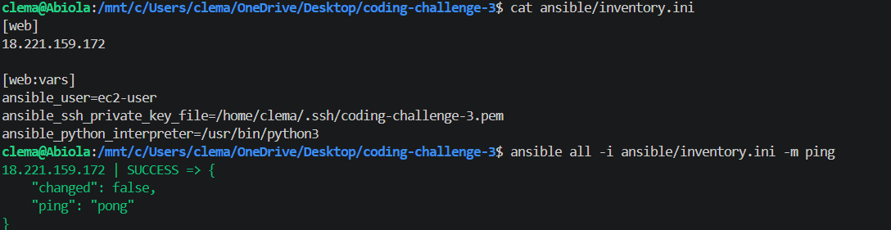

This confirms:

- The inventory is valid
- SSH authentication works
- Ansible can reach the EC2 host
- Python is available on the managed server

---

# Ansible Playbook

The configuration is defined in:

```text
ansible/playbook.yml
```

The playbook targets the `web` host group and uses privilege escalation with:

```yaml
become: true
```

The playbook performs three main configuration tasks.

---

## Install Nginx

Ansible installs the Nginx package using the Amazon Linux package manager.

Conceptually:

```text
Ansible
   ↓
dnf
   ↓
nginx
```

---

## Start and Enable Nginx

The Nginx service is:

```text
started
enabled
```

This means Nginx starts immediately and is configured to start automatically when the EC2 instance boots.

---

## Deploy the Web Page

Ansible manages:

```text
/usr/share/nginx/html/index.html
```

The page contains:

```text
Hello, World!
Deployed with Terraform and Ansible.
```

Because Ansible owns the desired content, rerunning the playbook can automatically restore the expected page if it changes.

---

# Running the Ansible Playbook

The playbook is first syntax-checked:

```bash
ansible-playbook \
  -i ansible/inventory.ini \
  ansible/playbook.yml \
  --syntax-check
```

Then executed:

```bash
ansible-playbook \
  -i ansible/inventory.ini \
  --private-key ~/.ssh/coding-challenge-3.pem \
  ansible/playbook.yml
```

The initial run completed successfully:

```text
ok=4
changed=3
unreachable=0
failed=0
```

### Ansible Playbook Success

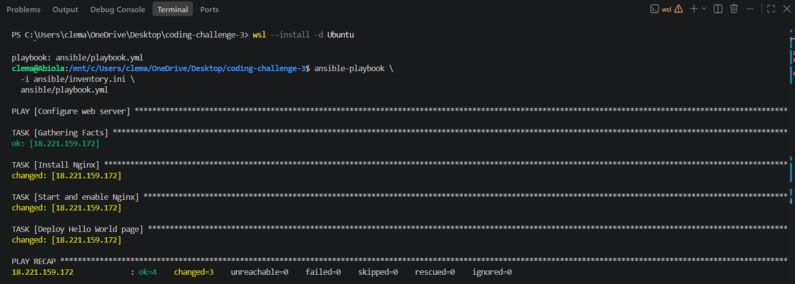

The changed tasks confirm that Ansible:

1. Installed Nginx
2. Started and enabled Nginx
3. Deployed the custom web page

---

# Ansible Idempotency

The playbook was executed a second time after the server was already configured.

The second run returned:

```text
ok=4
changed=0
unreachable=0
failed=0
```

This demonstrates **idempotency**.

Ansible inspected the server, determined that it already matched the desired configuration, and made no unnecessary changes.

This is an important configuration-management principle because the same playbook can be safely executed multiple times.

---

# Application Verification

The completed Nginx deployment is accessible using the EC2 public IP over HTTP.

The page displays:

```text
Hello, World!

Deployed with Terraform and Ansible.
```

### Public Web Application

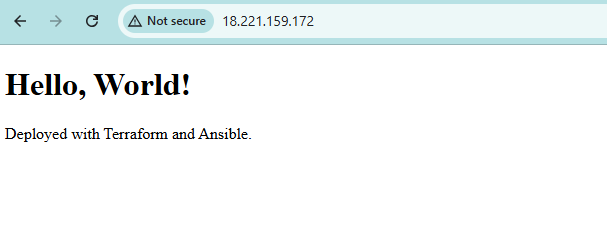

This validates the complete deployment path:

```text
Terraform
   ↓
AWS EC2
   ↓
Ansible
   ↓
Nginx
   ↓
Hello World
   ↓
Public HTTP Request
```

---

# Complete Deployment Procedure

A new deployment can be reproduced using the following workflow.

## 1. Clone the Repository

```bash
git clone https://github.com/ClementAkanyah/coding-challenge-3.git
cd coding-challenge-3
```

---

## 2. Configure AWS Authentication

Verify:

```bash
aws sts get-caller-identity
```

---

## 3. Configure the Terraform Key Pair

Create:

```text
terraform/terraform.tfvars
```

Example:

```hcl
key_name = "your-ec2-key-pair"
```

---

## 4. Initialize Terraform

```bash
cd terraform
terraform init
```

---

## 5. Validate the Configuration

```bash
terraform fmt
terraform validate
```

---

## 6. Review the Infrastructure Plan

```bash
terraform plan -out=tfplan
```

Review the plan before continuing.

---

## 7. Provision AWS Infrastructure

```bash
terraform apply tfplan
```

Retrieve the public IP:

```bash
terraform output -raw ec2_public_ip
```

---

## 8. Update the Ansible Inventory

Set the Terraform-created EC2 public IP in:

```text
ansible/inventory.ini
```

---

## 9. Test Ansible Connectivity

From WSL/Ubuntu:

```bash
ansible all \
  -i ansible/inventory.ini \
  --private-key ~/.ssh/your-key.pem \
  -m ping
```

---

## 10. Configure the Web Server

```bash
ansible-playbook \
  -i ansible/inventory.ini \
  --private-key ~/.ssh/your-key.pem \
  ansible/playbook.yml
```

---

## 11. Access the Web Page

Open:

```text
http://<EC2_PUBLIC_IP>
```

Expected result:

```text
Hello, World!
Deployed with Terraform and Ansible.
```

---

# Security Considerations

Several security practices were incorporated into the implementation.

## Source Control

The repository does not contain:

```text
Terraform state
Terraform tfvars
Terraform plan files
SSH private keys
AWS credential files
Environment secrets
```

These files are excluded using `.gitignore`.

---

## AWS Credentials

Permanent AWS credentials are not hard-coded inside Terraform or Ansible.

Terraform uses the locally configured AWS CLI authentication context.

---

## SSH Keys

The EC2 private SSH key is not committed to GitHub.

Ansible receives the private key using:

```text
--private-key
```

at runtime.

---

## IAM

EC2 receives its AWS identity through:

```text
IAM Role
   ↓
Instance Profile
   ↓
EC2
```

This avoids storing permanent IAM user credentials on the EC2 instance.

---

## Network Security

The challenge requires SSH and HTTP access.

The security group currently exposes:

```text
22/tcp
80/tcp
```

For production use, SSH should be restricted to a known administrative IP range.

---

# Troubleshooting

## Terraform Provider Cache Error

During development, Terraform reported a cached provider checksum mismatch.

The provider cache and lock file were recreated:

```powershell
Remove-Item -Recurse -Force .\.terraform
Remove-Item .\.terraform.lock.hcl
terraform init
```

Terraform then initialized and validated successfully.

---

## Terraform Cannot Find the Security Group

Terraform initially reported:

```text
Reference to undeclared resource
```

for:

```text
aws_security_group.web
```

The issue was resolved by ensuring that `security-group.tf` existed in the Terraform root module and contained the required `aws_security_group` resource.

---

## Ansible Is Not Available in Windows PowerShell

Ansible is primarily Linux-based.

WSL 2 with Ubuntu was installed and used as the Ansible control environment.

Ubuntu can be launched from PowerShell with:

```powershell
wsl -d Ubuntu
```

---

## Ansible Cannot Connect to EC2

Test SSH independently first:

```bash
ssh -i ~/.ssh/your-key.pem ec2-user@<EC2_PUBLIC_IP>
```

Then test Ansible:

```bash
ansible all \
  -i ansible/inventory.ini \
  --private-key ~/.ssh/your-key.pem \
  -m ping
```

A successful test returns:

```text
ping: pong
```

---

# Cleanup and Cost Control

The AWS resources should be destroyed when the challenge no longer needs to remain available.

From the Terraform directory:

```bash
cd terraform
terraform plan -destroy
```

Review the destroy plan carefully.

Then run:

```bash
terraform destroy
```

Terraform will remove the resources it manages.

Always verify the AWS account afterward to make sure no manually created or unrelated billable resources remain.

---

# Challenge Requirements Verification

| Requirement | Result |
| --- | --- |
| EC2 provisioned with Terraform | ✅ |
| S3 bucket provisioned with Terraform | ✅ |
| IAM role provisioned with Terraform | ✅ |
| Security group provisioned with Terraform | ✅ |
| Ansible used for configuration management | ✅ |
| Nginx installed using Ansible | ✅ |
| Nginx started and enabled | ✅ |
| Hello World page deployed with Ansible | ✅ |
| Public HTTP application accessible | ✅ |
| Private GitHub repository | ✅ |
| Terraform code version controlled | ✅ |
| Ansible code version controlled | ✅ |
| README installation instructions | ✅ |
| README deployment instructions | ✅ |
| Terraform code explanation | ✅ |
| Ansible code explanation | ✅ |

---

# Key Outcomes

This project demonstrates practical experience with:

- Infrastructure as Code
- Terraform configuration organization
- Terraform dependency locking
- Terraform plans and lifecycle management
- AWS EC2
- Amazon S3
- S3 versioning
- AWS IAM roles
- EC2 instance profiles
- AWS Security Groups
- AWS CLI
- Linux administration
- SSH
- WSL 2
- Ansible inventories
- Ansible ad-hoc commands
- Ansible playbooks
- Ansible privilege escalation
- Ansible idempotency
- Nginx
- Git
- GitHub
- Infrastructure validation
- Configuration verification
- Cloud-resource cleanup and cost awareness

---

# Deployment Result

The challenge was completed successfully.

```text
Terraform → SUCCESS
EC2       → RUNNING
S3        → VERSIONING ENABLED
IAM       → CREATED
Ansible   → SUCCESS
Nginx     → RUNNING
Web Page  → HELLO, WORLD!
```

The application is available at:

```text
http://18.221.159.172
```

> The public EC2 IP may change if the instance is stopped and started because this implementation uses the instance public IP rather than a dedicated Elastic IP.

---

# Repository

GitHub repository:

```text
https://github.com/ClementAkanyah/coding-challenge-3
```

The repository is maintained as a **private GitHub repository** for challenge submission.

---

## Author

**Clement Akanyah**

Cloud Engineer Coding Challenge 3 — Infrastructure as Code with Terraform and Ansible
